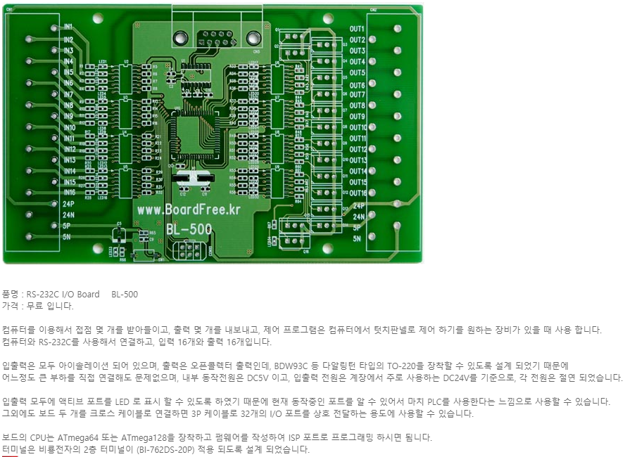

[ ](/Materials/boardfree site.PNG)





# BL500_FW
* Develop BoardFress.inc BL-500 Board Firmware
* 이 프로젝트는 보드프리 Link( ) BL-500 보드의 Firmware제작 프로젝트 입니다.
* 이 프로젝트에서의 목표 기능은 다음과 같습니다.
     1. DI 16 Chnnel (digital input)
     2. DO 16 Chnnel (digital output)


# Hardware
 * from http://boardfree.kr/ ->> project탭에서 하단부 80%지점
 ```
 품명 : RS-232C I/O Board    BL-500
 가격 : 무료 입니다.

 컴퓨터를 이용해서 접점 몇 개를 받아들이고, 출력 몇 개를 내보내고, 제어 프로그램은 컴퓨터에서 텃치판넬로 제어 하기를 원하는 장비가 있을 때 사용 합니다.

 컴퓨터와 RS-232C를 사용해서 연결하고, 입력  16개와 출력 16개입니다.

 입출력은 모두 아이솔레이션 되어 있으며, 출력은 오픈콜렉터 출력인데, BDW93C 등 다알링턴 타입의 TO-220을 장착할 수 있도록 설계 되었기 때문에

 어느정도 큰 부하를 직접 연결해도 문제없으며, 내부 동작전원은 DC5V 이고, 입출력 전원은 계장에서 주로 사용하는 DC24V를 기준으로, 각 전원은 절연 되었습니다.

 입출력 모두에 액티브 포트를 LED 로 표시 할 수 있도록 하였기 때문에 현재 동작중인 포트를 알 수 있어서 마치 PLC를 사용한다는 느낌으로 사용할 수 있습니다.

 그외에도 보드 두 개를 크로스 케이블로 연결하면 3P 케이블로 32개의 I/O 포트를 상호 전달하는 용도에 사용할 수 있습니다.

 보드의 CPU는 ATmega64 또는 ATmega128을 장착하고 펌웨어를 작성하여 ISP 포트로 프로그래밍 하시면 됨니다.

 터미널은 비룡전자의 2층 터미널이 (BI-762DS-20P) 적용 되도록 설계 되었습니다.
 ```
# Software (code)

# 맺음말
 ##  boardfree 관계자분들 감사합니다!
